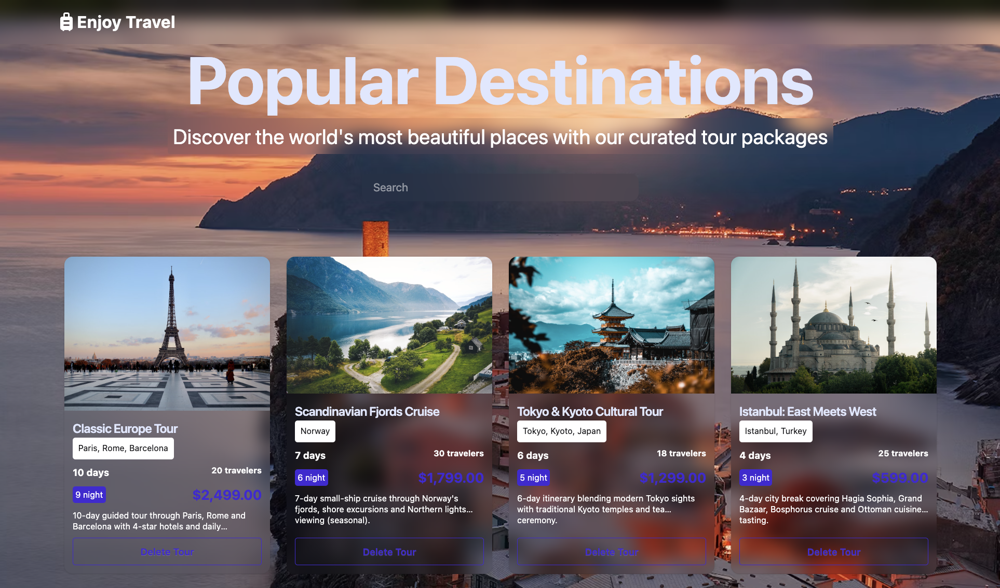
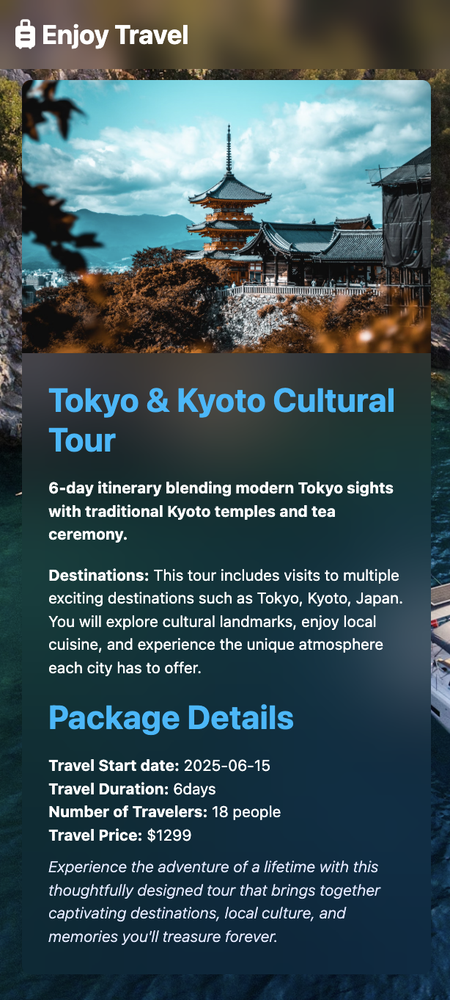
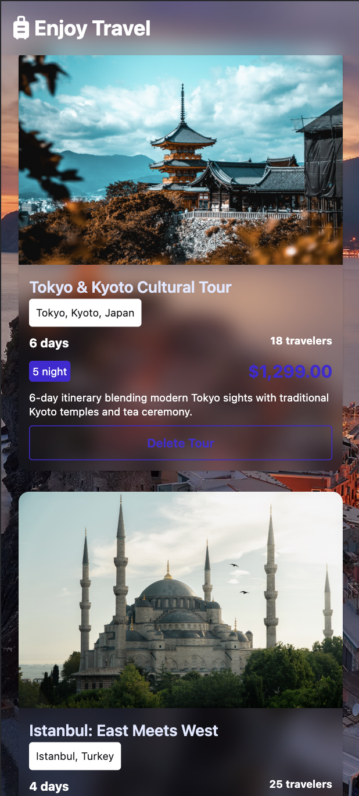
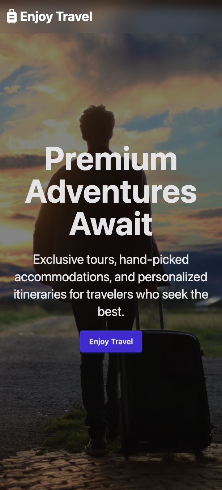

# 🌍 Enjoy Travel - Premium Travel Booking Platform


## 📱 Preview

<div align="center">

### Desktop View





### Mobile View





</div>

## 📖 About The Project

**Enjoy Travel** is a modern, responsive travel booking platform that offers premium tour packages and travel experiences. Built with cutting-edge web technologies, it provides users with an intuitive interface to discover, search, and book luxury travel packages around the world.

### ✨ Key Features

- 🏠 **Dynamic Hero Section** - Animated text rotator with premium travel slogans
- 🔍 **Advanced Search** - Real-time search functionality for travel packages
- 📱 **Fully Responsive** - Optimized for desktop, tablet, and mobile devices
- 🎨 **Modern UI/UX** - Clean design with smooth animations and transitions
- 🌟 **Interactive Cards** - Beautiful travel package cards with hover effects
- 📋 **Package Management** - Add, view, and manage travel packages
- 🔄 **Real-time Updates** - Dynamic content loading from API
- 🎯 **Detailed Views** - Comprehensive package details with booking options
- 🍞 **Toast Notifications** - User feedback with elegant toast messages
- ⚡ **Fast Performance** - Optimized build with Vite for lightning-fast loading

## 🖥️ Live Demo

### 🏠 Homepage

- **Hero Section**: Eye-catching banner with rotating travel slogans
- **Search Bar**: Instant search through available packages
- **Featured Tours**: Curated selection of premium travel experiences

### 🌟 Popular Destinations

- **Package Grid**: Responsive card layout showcasing travel packages
- **Filter Options**: Search and filter functionality
- **Package Cards**: Detailed information with pricing and duration

### 📄 Package Details

- **Comprehensive Info**: Full package details including itinerary
- **Booking Interface**: Streamlined booking process
- **Recommended Tours**: Related package suggestions
- **Responsive Layout**: Optimized for all screen sizes

## 🛠️ Built With

### Core Technologies

- **[Vite](https://vitejs.dev/)** - Next generation frontend tooling
- **[JavaScript ES6+](https://developer.mozilla.org/en-US/docs/Web/JavaScript)** - Modern JavaScript features
- **[HTML5](https://developer.mozilla.org/en-US/docs/Web/HTML)** - Semantic markup

### Styling & UI

- **[Tailwind CSS](https://tailwindcss.com/)** - Utility-first CSS framework
- **[DaisyUI](https://daisyui.com/)** - Tailwind CSS components library
- **Custom CSS** - Additional styling for unique components

### Libraries & Tools

- **Toast Library** - User notification system
- **Real API Integration** - Dynamic data fetching
- **Local Storage** - Client-side data persistence
- **ES6 Modules** - Modular JavaScript architecture

## 🚀 Getting Started

### Prerequisites

Make sure you have the following installed:

- **Node.js** (version 16.0 or higher)
- **npm** or **yarn** package manager
- **Git** for version control

### Installation

1. **Clone the repository**

   ```bash
   git clone https://github.com/khamzaevasad/travel.git
   ```

2. **Navigate to the project directory**

   ```bash
   cd enjoy-travel
   ```

3. **Install dependencies**

   ```bash
   npm install
   # or
   yarn install
   ```

4. **Start the development server**

   ```bash
   npm run dev
   # or
   yarn dev
   ```

5. **Open your browser**
   ```
   http://localhost:5173
   ```

### Build for Production

```bash
npm run build
# or
yarn build
```

### Preview Production Build

```bash
npm run preview
# or
yarn preview
```

```
enjoy-travel/
├── public/
│   ├── images/
│   └── favicon.ico
├── src/
│   ├── components/
│   │   ├── ui/
│   │   └── layout/
│   ├── pages/
│   │   ├── index.html
│   │   └── travelDetail.html
│   ├── scripts/
│   │   ├── main.js
│   │   ├── search.js
│   │   ├── detail.js
│   │   └── utils/
│   ├── styles/
│   │   └── main.css
│   └── utils/
│       ├── api.js
│       ├── formatNumber.js
│       └── updateUI.js
├── package.json
├── vite.config.js
├── tailwind.config.js
└── README.md
```

## 🎯 Features Overview

### 🏠 Hero Section

- **Dynamic Text Animation**: Rotating travel slogans every 4 seconds
- **Responsive Design**: Adapts beautifully to all screen sizes
- **Call-to-Action**: Prominent booking button

### 🔍 Search & Filter

- **Real-time Search**: Instant results as you type
- **Smart Filtering**: Filter by destination, duration, and price
- **No Results Handling**: Elegant empty state display

### 🎴 Travel Cards

- **Interactive Design**: Hover effects and smooth animations
- **Comprehensive Info**: Duration, travelers, pricing, and more
- **Responsive Grid**: Adapts from 1 column (mobile) to 4 columns (desktop)

### 📱 Responsive Design

- **Mobile-First**: Optimized for mobile devices
- **Tablet Support**: Perfect medium screen experience
- **Desktop Enhanced**: Full-featured desktop interface
- **Cross-Browser**: Compatible with all modern browsers

### ⚡ Performance Features

- **Lazy Loading**: Images load as needed
- **Code Splitting**: Optimized bundle sizes
- **Fast Refresh**: Hot module replacement during development
- **Minified Assets**: Compressed CSS and JavaScript

## 🎨 Design System

### Color Palette

- **Primary**: Travel-inspired blues and teals
- **Secondary**: Warm sunset oranges and yellows
- **Neutral**: Clean grays for text and backgrounds
- **Accent**: Vibrant colors for CTAs and highlights

### Typography

- **Headers**: Bold, modern sans-serif fonts
- **Body Text**: Clean, readable typography
- **Responsive Scaling**: Fluid typography across devices

### Components

- **Cards**: Consistent design language
- **Buttons**: Multiple variants and states
- **Forms**: User-friendly input fields
- **Navigation**: Intuitive menu systems

## 🔧 Configuration

### Tailwind CSS

Custom configuration in `tailwind.config.js` includes:

- Extended color palette
- Custom spacing scales
- Responsive breakpoints
- Animation utilities

### Vite

Optimized build configuration with:

- Fast HMR (Hot Module Replacement)
- CSS preprocessing
- Asset optimization
- Development server settings

## 📱 Responsive Breakpoints

```css
/* Mobile */
@media (max-width: 640px) {
  /* sm */
}

/* Tablet */
@media (min-width: 641px) and (max-width: 1024px) {
  /* md-lg */
}

/* Desktop */
@media (min-width: 1025px) {
  /* xl+ */
}
```

## 🌐 API Integration

The application integrates with a real travel API to provide:

- **Dynamic Package Data**: Live travel package information
- **Real-time Pricing**: Up-to-date pricing and availability
- **Destination Details**: Comprehensive location information
- **Booking Management**: Handle reservations and confirmations

## 🤝 Contributing

Contributions are what make the open source community such an amazing place to learn, inspire, and create. Any contributions you make are **greatly appreciated**.

1. **Fork the Project**
2. **Create your Feature Branch** (`git checkout -b feature/AmazingFeature`)
3. **Commit your Changes** (`git commit -m 'Add some AmazingFeature'`)
4. **Push to the Branch** (`git push origin feature/AmazingFeature`)
5. **Open a Pull Request**

### Development Guidelines

- Follow ES6+ JavaScript standards
- Use Tailwind CSS for styling
- Maintain responsive design principles
- Write clean, commented code
- Test across different devices and browsers

## 📄 License

This project is licensed under the MIT License - see the [LICENSE](LICENSE) file for details.

## 👨‍💻 Author

**Your Name**

- GitHub: [@khamzaevasad](https://github.com/khamzaevasad)
- Email: xamzayevasad442@gmail.com

## 🙏 Acknowledgments

- **[Unsplash](https://unsplash.com/)** - Beautiful travel photography
- **[Tailwind CSS Team](https://tailwindcss.com/)** - Amazing utility-first framework
- **[DaisyUI](https://daisyui.com/)** - Beautiful component library
- **[Vite Team](https://vitejs.dev/)** - Lightning-fast build tool
- **Travel Industry** - Inspiration for creating amazing travel experiences

## 📞 Support

<div align="center">
  <p>Made with ❤️ for travelers around the world</p>
  <p>© 2025 Enjoy Travel. All rights reserved.</p>
</div>
